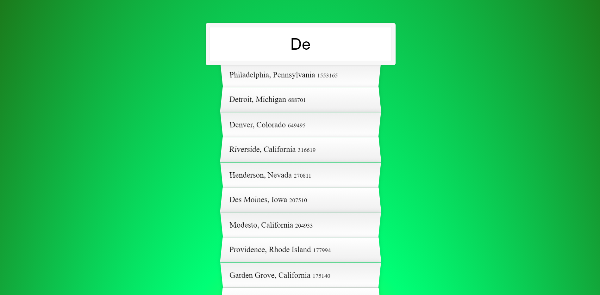

# JavaScript30-WesBos-Challenge
30 day vanilla JS coding challenge from Wes Bos

You can find the course there: [JavaScript30](https://javascript30.com)

## Screenshots
* 01 - JavaScript Drum Kit 

* 02 - JS and CSS Clock 

* 03 - CSS Variables 

* 04 - Array Cardio Day 1 

* 05 - Flex Panel Gallery 

* 06 - Ajax Type Ahead 

* 07 - Array Cardio Day 2 

* 08 - Fun with HTML5 Canvas 

* 09 - Dev Tools Domination 

* 10 - Hold Shift and Check Checkboxes 
